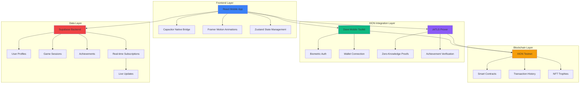
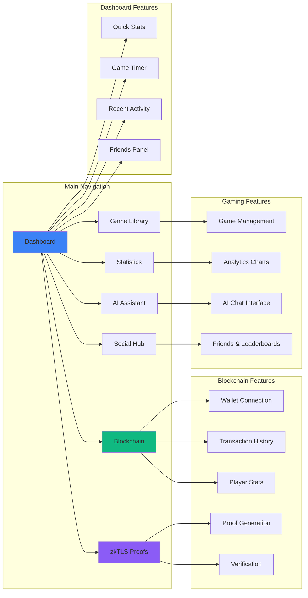
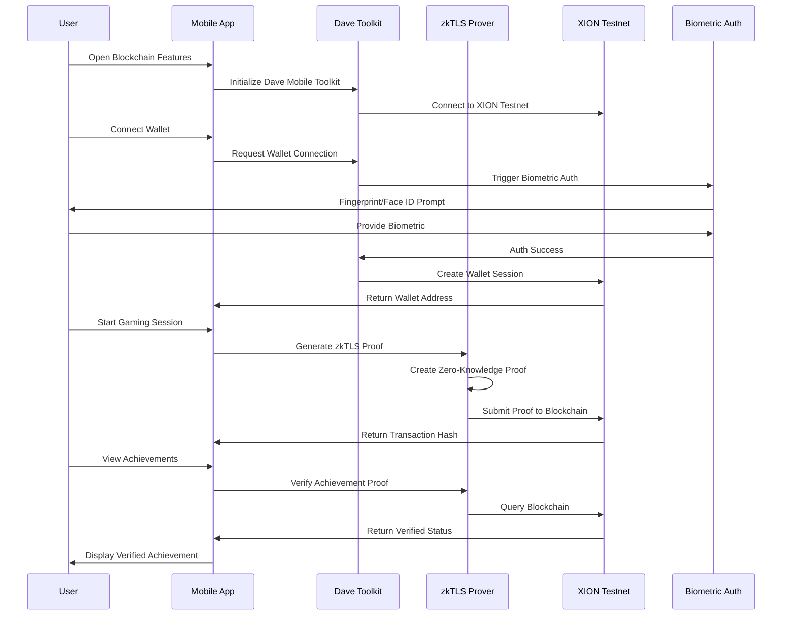
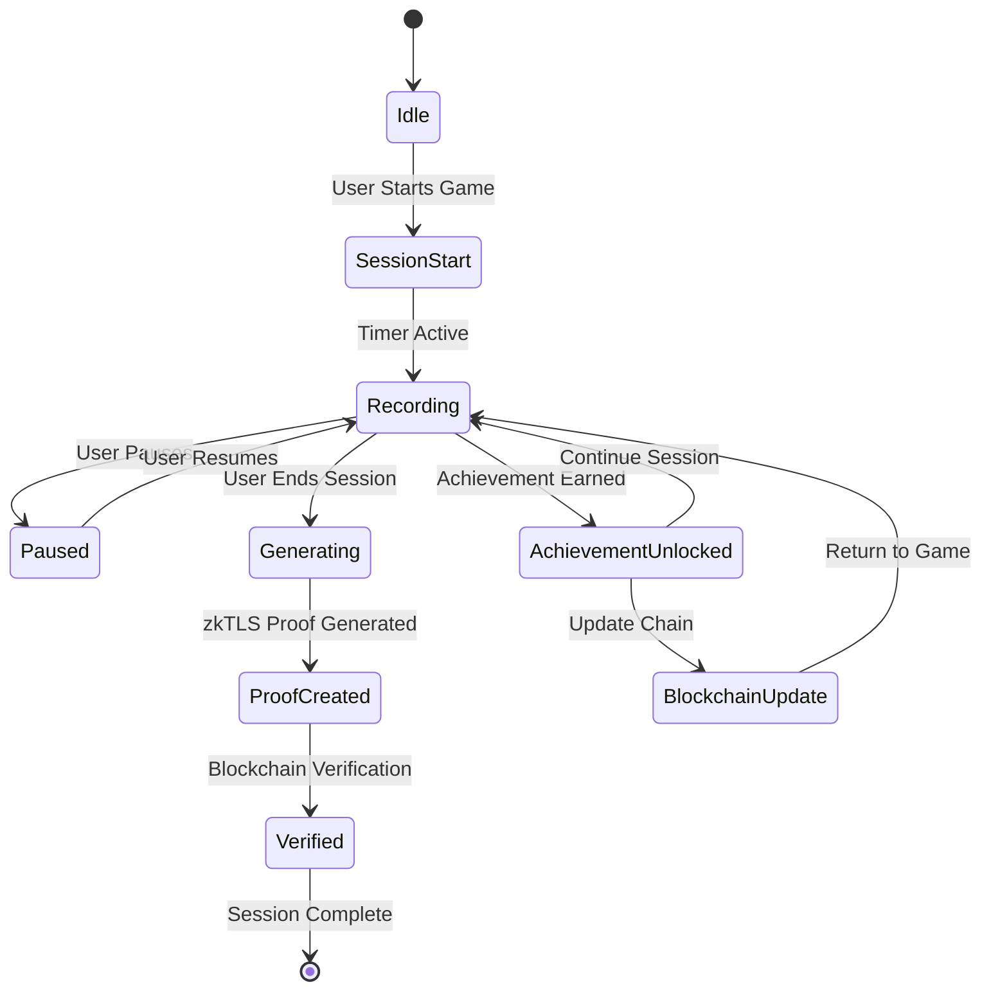
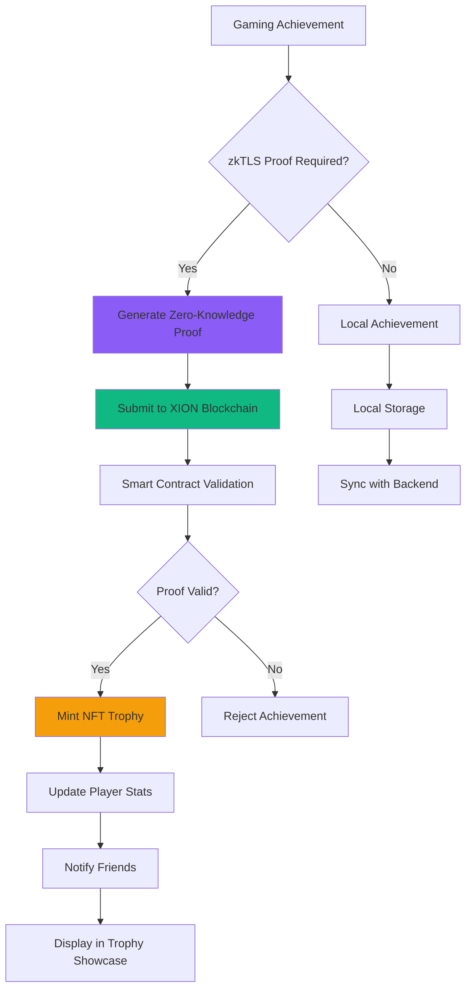
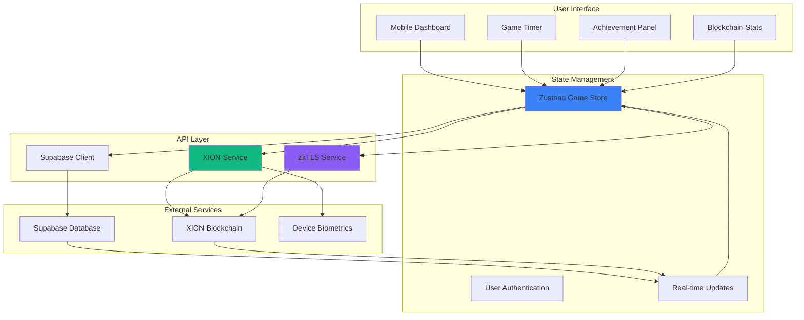
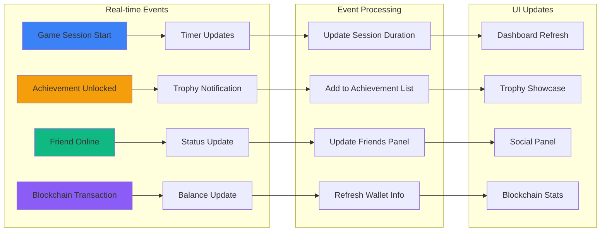
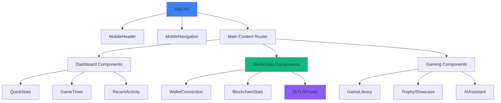

# XION Gaming Hub - Architecture & UI Flow Diagrams

## 🏗️ System Architecture Overview

## 📱 Mobile UI Flow Architecture

## 🔐 XION Blockchain Integration Flow

## 🎮 Gaming Session Tracking Flow

## 🏆 Achievement Verification System

## 📊 Data Flow Architecture

## 🔄 Real-time Features Flow

## 🎯 Component Hierarchy

---

## 🚀 Key Features Highlighted

### ✅ **Implemented Features**
- **Mobile-First Design** with responsive UI
- **XION Blockchain Integration** via Dave Mobile Toolkit
- **zkTLS Proof Generation** for achievement verification
- **Biometric Wallet Security** for mobile devices
- **Real-time Gaming Session Tracking**
- **Social Gaming Features** with friends and leaderboards
- **AI-Powered Gaming Assistant**
- **Cross-Platform Game Library Management**

### 🔧 **Technical Stack**
- **Frontend:** React 18 + TypeScript + Tailwind CSS
- **Mobile:** Capacitor for native device features
- **Blockchain:** XION Dave Mobile Toolkit + zkTLS
- **Backend:** Supabase for real-time data
- **State:** Zustand for efficient state management
- **Animations:** Framer Motion for smooth UX

### 📱 **Mobile Optimizations**
- Touch-friendly navigation with hamburger menu
- Biometric authentication integration
- Haptic feedback for interactions
- Progressive Web App (PWA) capabilities
- Offline-first architecture with sync